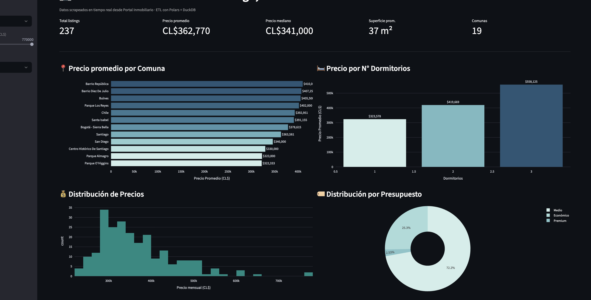
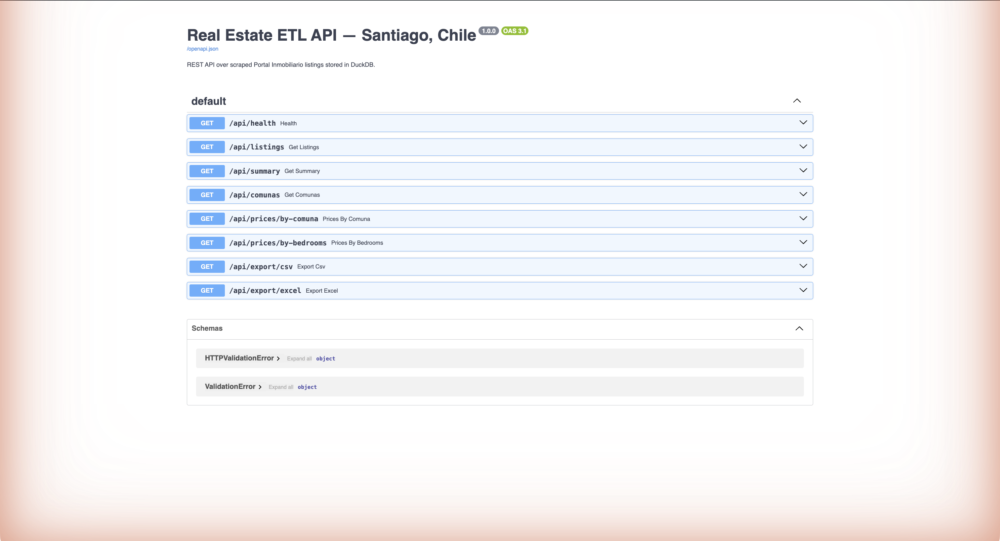

# Real Estate ETL Pipeline + Dashboard


Python ETL project that scrapes real estate listings from **Portal Inmobiliario Chile**, cleans and enriches the data with **Polars**, stores it in **DuckDB**, exposes analytics through SQL and a **Streamlit dashboard**, and serves a **FastAPI REST API** with CSV/Excel export.

**Useful for:** real estate market analysis · web scraping automation · ETL/data engineering portfolio · dashboard and reporting automation · price tracking and market intelligence

---

## Client use cases

| Goal | How this project delivers |
|---|---|
| Scrape a website and clean the data | `extract.py` + `transform.py` — live scraping with Polars ETL |
| Store results in a fast analytical database | DuckDB bulk load with typed schema |
| Build a dashboard with filters and charts | Streamlit + Plotly with sidebar filters |
| Deliver data as CSV / Excel | One-click export from dashboard and REST API |
| Expose data via a REST API | FastAPI with pagination, filters, and file export |
| Run everything in a reproducible environment | Docker Compose — pipeline, dashboard, and API services |
| Automate and schedule the pipeline | `python src/main.py` — ready for cron or Airflow |



---

## What it does

1. **Scrapes** live property listings from Portal Inmobiliario using [Scrapling](https://github.com/D4Vinci/Scrapling) — an adaptive scraping framework with anti-bot capabilities
2. **Transforms** raw data with Polars: parses prices, bedrooms, m², computes UF price, budget category, price per m²
3. **Loads** clean data into DuckDB for fast analytical SQL queries
4. **Visualizes** market insights in a Streamlit dashboard with filters, charts, and clickable links to each property
5. **Exports** data as CSV or Excel directly from the dashboard download buttons
6. **Serves** a FastAPI REST API with endpoints for listings, summary stats, and CSV export

---

## Pipeline

```
Portal Inmobiliario (live scrape)
        │  Scrapling — stealthy HTTP, adaptive selectors
        ▼
  extract.py    ← 5 pages × 48 listings = ~240 properties
        │
        ▼
  transform.py  ← Polars: clean, validate, enrich
        │  - parse price strings (CL$363.000 → 363000.0)
        │  - parse bedrooms/bathrooms/sqm from text
        │  - drop rows outside business rules
        │  - add: price_uf, price_per_sqm, budget_category, url
        ▼
  load.py       ← DuckDB: schema + bulk insert
        │
        ▼
  analytics.py  ← SQL: avg by comuna, by bedrooms, budget distribution
        │
        ▼
  dashboard.py  ← Streamlit: interactive filters + Plotly charts
```

---

## Sample output

```
── Market Summary — Arriendos Santiago ──────────
  Total listings    : 237
  Comunas           : 19
  Precio promedio   : CL$363,214 (9.6 UF)
  Precio mediano    : CL$341,000
  Superficie prom.  : 37 m²
  Rango precios     : CL$224,000 – CL$770,000

── Precio por N° Dormitorios ─────────────────────
  1 dorm.   CL$   325,701   31 m²
  2 dorm.   CL$   417,323   46 m²
  3 dorm.   CL$   558,125   69 m²
```

---

## Quickstart

```bash
git clone https://github.com/Arcan17/real-estate-etl.git
cd real-estate-etl

python -m venv .venv
source .venv/bin/activate   # Windows: .venv\Scripts\activate

pip install -r requirements.txt

# Run the ETL pipeline (scrapes live data)
python src/main.py

# Launch the dashboard
streamlit run dashboard.py
```

Open **http://localhost:8501** in your browser.

---

## REST API



Start the API server:

```bash
uvicorn src.api:app --reload
# Docs at http://localhost:8000/docs
```

| Method | Endpoint | Description |
|---|---|---|
| `GET` | `/api/health` | Health check |
| `GET` | `/api/listings` | Paginated listings with filters |
| `GET` | `/api/summary` | Market summary stats |
| `GET` | `/api/comunas` | All comunas with avg price |
| `GET` | `/api/prices/by-comuna` | Avg price per commune |
| `GET` | `/api/prices/by-bedrooms` | Avg price by bedroom count |
| `GET` | `/api/export/csv` | Download all listings as CSV |
| `GET` | `/api/export/excel` | Download all listings as Excel (.xlsx) |

```bash
# Examples
curl "http://localhost:8000/api/summary"
curl "http://localhost:8000/api/listings?comuna=Providencia&bedrooms=2"
curl "http://localhost:8000/api/export/csv" -o listings.csv
curl "http://localhost:8000/api/export/excel" -o listings.xlsx
```

<details>
<summary>Sample JSON response — <code>/api/summary</code></summary>

```json
{
  "total_listings": 237,
  "comunas": 19,
  "avg_price_clp": 363214,
  "median_price_clp": 341000,
  "avg_sqm": 37.2,
  "min_price_clp": 224000,
  "max_price_clp": 770000
}
```
</details>

## Docker

```bash
# 1. Run the ETL pipeline first (generates data/listings.duckdb)
docker compose --profile pipeline run pipeline

# 2. Launch the Streamlit dashboard
docker compose up dashboard

# 3. Launch the FastAPI REST API
docker compose --profile api up api
```

## Running tests

```bash
pytest tests/ -v
# 45 passed  (19 transform + 26 API)
```

---

## Project structure

```
real-estate-etl/
├── src/
│   ├── extract.py      # Scrapling scraper — Portal Inmobiliario
│   ├── transform.py    # Polars transformations and business rules
│   ├── load.py         # DuckDB schema creation and bulk load
│   ├── analytics.py    # SQL market analytics queries
│   ├── main.py         # Pipeline orchestrator
│   └── api.py          # FastAPI REST API
├── dashboard.py        # Streamlit interactive dashboard (+ CSV/Excel export)
├── tests/
│   ├── test_transform.py   # 19 ETL unit tests
│   └── test_api.py         # 26 API endpoint tests
├── Dockerfile
├── docker-compose.yml
├── requirements.txt
└── .github/workflows/ci.yml
```

---

## Tech stack

| Layer | Technology |
|---|---|
| Scraping | Scrapling 0.4+ (adaptive, anti-bot) |
| Data transformation | Polars 0.20+ |
| Analytical database | DuckDB 0.10+ |
| Dashboard | Streamlit + Plotly |
| REST API | FastAPI + Uvicorn |
| Export | CSV + Excel (openpyxl) |
| Columnar format | Apache Parquet |
| Containerization | Docker + Docker Compose |
| Testing | pytest (45 tests: 19 ETL + 26 API) |
| CI/CD | GitHub Actions |

---

## License

MIT
